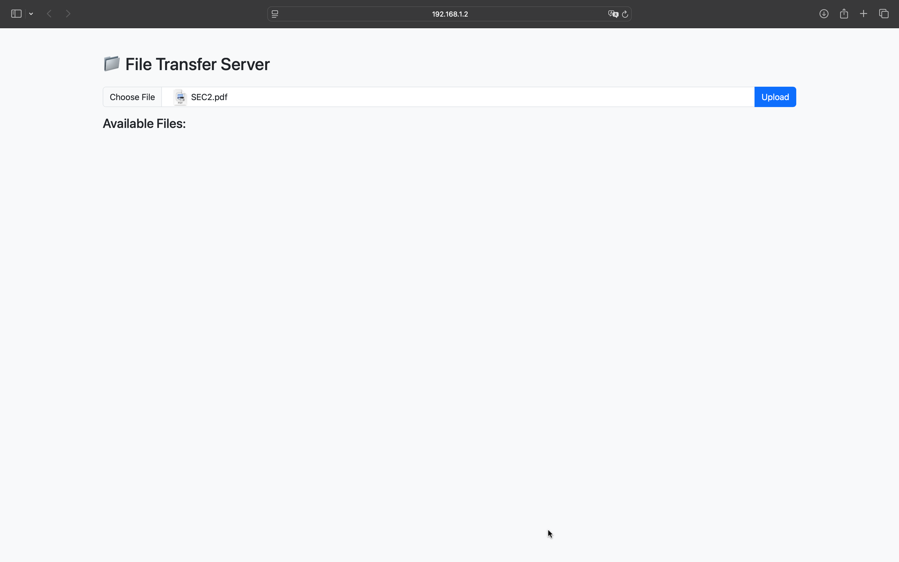

# 🚀 FlyFiles – LAN File Transfer with Beautiful UI

**FlyFiles** is a lightweight Python web application that lets you easily transfer files between devices on the same network using a stylish web interface built with Flask and Bootstrap.

---

## 🌟 Features

- 📤 Upload files via browser (from any device on the LAN)
- 📥 Download files shared by others
- 💅 Clean and modern UI with Bootstrap 5
- 🔒 Runs locally – no internet required
- 🧠 Zero setup – just run and go!

---

## 🛠️ Requirements

- Python 3.6+
- Flask (`pip install flask`)

---

## ⚙️ Setup & Run

```bash
git clone https://github.com/mouhadjer20/flyfiles.git
cd flyfiles
pip install flask
python app.py
```
- Open the browser on another device and visit: `http://<sender-ip>:8000`
- Example: `http://192.168.1.10:8000`
- 
---

## 📸 Screenshots

<p float="left">
  
</p>

---

## 💡 Use Case

- Share files across computers, phones, or tablets on the same network
- Great for classrooms, offices, or labs
- Works offline – no external servers involved

---

## 🔐 Security Note

This app is meant for **trusted LAN environments** only.  
No user authentication is implemented by default.

---

## 📦 License

MIT License – use, modify, and share freely.

---

## 🧑‍💻 Author

Built by [Mouhadjer20](https://github.com/Mouhadjer20)  
Feel free to contribute or fork! ⭐
